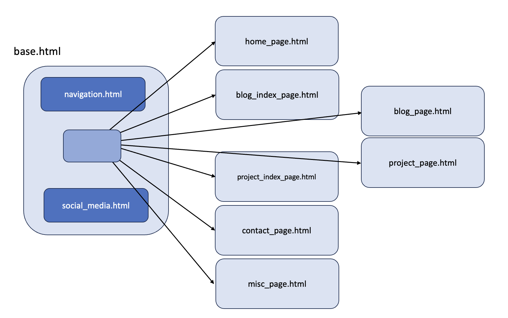

## Learn Wagtail - Wagtailify your static website

by Kalob Taulien: https://learnwagtail.com/courses/wagtailify-your-static-website/

link to GitHub: https://github.com/CodingForEverybody/wagtailify-your-static-website

use PORT 8002 for `python manage.py runserver 0.0.0.0:8002` cmd for localhost instead of 8000 (avoid clashing with jisc-ac-uk setup)

### Customise python for this project
To use different versions of python in different projects use `pyenv` https://python.land/virtual-environments/pyenv
  - `su localadmin` then `brew install pyenv`
  - add pyenv to zsh shell
```
echo 'export PYENV_ROOT="$HOME/.pyenv"' >> ~/.zshrc
echo '[[ -d $PYENV_ROOT/bin ]] && export PATH="$PYENV_ROOTbin:$PATH"' >> ~/.zshrc
echo 'eval "$(pyenv init -)"' >> ~/.zshrc
```
  - restart your shell using `exec "$SHELL"` cmd

To manage the python virtual environment add `pyenv-virtualenv` as a plugin to pyenv https://github.com/pyenv/pyenv-virtualenv?tab=readme-ov-file
  - `su localadmin` then `brew install pyenv-virtualenv`
  - add pyenv-virtualenv to zsh shell
```
$ echo 'eval "$(pyenv virtualenv-init -)"' >> ~/.zshrc
```
  - restart your shell using `exec "$SHELL"` cmd

### Set-up
Set python preferred version in project root directory 
- add python version 3.11.4 using `pyenv install 3.11.4` cmd 
- set this project directory to use v3.11.4 with `pyenv local 3.11.4` cmd

Set up virtual environment in project root directory
- create vitual env using `pyenv virtualenv <venv_name>` cmd
- list all virtual envs with `pyenv virtualenvs` cmd
- start virtual env using `pyenv activate <venv_name>` cmd
- deactivate virtual env using `pyenv deactivate` cmd

Install Wagtail
- install wagtail in virtual environment using `pip install wagtail`
- check installed using `pip show wagtail`

### Atlas Template
source for static webpages: [Atlas - free TailwindCSS personal blog template](https://redpixelthemes.com/templates/atlas/)

### TL;DR Summary of Learnings
- using the Atlas website static template
- start up local pyenv environment 
- create a wagtail framework for your website app, with the name you want it to have, in this case `atlas`
- create your main app in root folder with `wagtail start atlas .` 
- generates standard wagtail folders
- run `pip install -r requirements.txt`
- current wagtail admin UI login is
    - name `clare`
    - password `clare`
- run `./manage.py migrate` to set up default database for `atlas`
  -  Note:
    - no `models.py` file exists in the `atlas` app, it only exists in the default `home`, `search`, and other future support apps e.g `blog`
    - the `atlas/settings` directory has all of the configuration for the `atlas` app
- edit `atlas` app by modifying `templates/base.html` template page.  
- copy paste HTML and tailwind code for homepage into `home` app  `templates/home/home_page.html` with hard coded content
- create new `site_settings` app and register code blocks in `site_settings/models.py` to be served on all webpages from `atlas/templates/base.html`
- personalise wagtail default home_page to your wagtail content and inject into `home/../home_page.html` template
- create new `blog` app and set up `blog index` page, `blog` page and use a StreamField and StructBlock to mix and match content types in the body
- create and use Snippets on pages and use Orderables
- reuse Template components across pages
- add Pagination
- create a Miscellaneous page type
- add Contact page with email capabilities, 
- for more control add PyPi packages like
  - [widget tweaks](https://pypi.org/project/django-widget-tweaks/)
  - [django-extensions](https://pypi.org/project/django-extensions/)
- delete unnecessary files

#### apps created as part of this wagtail project
- initial app `atlas`
- comes with `home` and `search`
- added functionality through
  - `site_settings` (configures items to appear on every page)
  - `blog` (blog index page and blog page)
  - `contact` (contact page with email form and contact landing page)
  - `misc` (generic page)
  - `projects` (similar to blog but for projects)
- [see the project folder tree](wagtail-static-site-folder-map.txt) 

#### PyPi packages installed as extras in terminal 
- pip install django-widget-tweaks
- python -m pip install -U djlint

#### How to use djLint for formatting
- in terminal run
  - `djlint . --check` for formatting html files (this is a beta tool)
  - `djlint . --lint` for linting html files

#### Diagram of html templates interaction



#### imports used in models.py
- in `site_settings/models.py`
```
from django.db import models

from wagtail.contrib.settings.models import BaseGenericSetting, register_setting
from wagtail.admin.panels import FieldPanel
```
- in `blog/models.py`
```
from django.db import models
from django.core.paginator import EmptyPage, PageNotAnInteger, Paginator

from wagtail.models import Page, Orderable
from wagtail.admin.panels import FieldPanel, InlinePanel
from wagtail.fields import StreamField
from wagtail import blocks
from wagtail.images.blocks import ImageChooserBlock
from wagtail.snippets.models import register_snippet

from modelcluster.fields import ParentalKey
```
- in `home/models.py`
```
from django.db import models

from wagtail.models import Page
from wagtail.admin.panels import FieldPanel, MultiFieldPanel

from blog.models import BlogIndexPage, BlogPage
```
- in `home/templatetags/models.py`
```
from django import template
from wagtail.models import Page

register = template.Library()
```

#### wagtail template code examples
in `atlas/templates/base.html`
  - ``
  - ` ... `
  - ``
  - ` .... ... `
  - ``
  - ```
    
      
        
  - ``
  - ```
     
      
    
  - ``

in `atlas/templates/common/navigation.html`
  - ``
  - `` (loading function)
  - ``
  - ``
  - ` ... `

in `home/templates/home/home_page.html`
  - ``
  - ``
  - ` ... `
  - ``
  - ```
    
      
    

in `blog/templates/blog/blog_index_page.html`
  - ``
  - ``
  - ` ... `
  - ```
    
      
    
  - ` ... `
  - ` ... `
  
in `blog/templates/blog/blog_page.html`
  - ``
  - ``
  - ` ... `
  - ``
  - ` ... `

### Course
1. & 2. Install summary

  Provides instructions for setting up a 'atlas' project in Wagtail. It covers creating a GitHub repo, setting up a Python virtual environment, installing Wagtail, starting the app, and configuring the Wagtail admin UI.

[Go to Lessons 1 & 2 learnings](Lesson-1-&-2.md)

3. Set up base.html summary

  Details the structure of a Wagtail project, highlighting the 'home' and 'atlas' directories. It explains how to modify 'home_page.html' which extends 'base.html' as the Wagtail UI home page. It also describes the structure and functionality of 'base.html', including how to load static files, templatetags, and the Wagtail admin interface.

[Go to Lesson 3 learnings](Lesson-3.md)

4. Global template tags summary

  Provides instructions for creating a reusable navigation bar in a Wagtail project. It involves creating a 'navigation.html' file, setting up a Django template tag to fetch navigation pages, and integrating this navigation bar into the `base.html` template. Changes require server restart.
  
[Go to Lesson 4 learnings](Lesson-4.md)

5. New global class summary

  Provides instructions for adding social media links to the footer of every page in a Wagtail project. It involves creating a 'social_media.html' file, setting up a new Django app 'site_settings' for managing social media links, and integrating these links into the `base.html` template. Changes require database migrations and server restart.

[Go to Lesson 5 learnings](#5-set-up-global-social-media-links)

6. Creating site_settings app summary

  Provides instructions to create a new Wagtail app called `site_settings`. This allows you to add a logo and website name to the header and footer of every page in a Wagtail project. It involves creating in `models.py` both `SocialMediaLinks` and `LogoSettings` classes, setting up the logo and site name in the Wagtail admin UI, and integrating these elements into the`atlas/templates/common` folder as `navigation.html` and `social_media.html` templates. Changes require database migrations.

[Go to Lesson 6 learnings](#6-custom-logo-and-website-name)

7. Create homepage hero summary

Provides instructions for customizing the homepage in a Wagtail project. It involves modifying the `HomePage` model in `home/models.py` to include an author image, summary, and CTA button. These elements are then integrated into the `home_page.html` template using Wagtail's template tags. Changes require database migrations.

[Go to Lesson 7 learnings](Lesson-7.md)

8. Create homepage content summary

Provides instructions for enhancing the homepage in a Wagtail project. It involves adding 'My Story' and 'Blog Posts' sections to the `HomePage` model and template. The 'My Story' section uses static fields, while the 'Blog Posts' section dynamically pulls from the `BlogPage` model. Changes require database migrations.

[Go to Lesson 8 learnings](Lesson-8.md)

9. Creating blog app summary

Provides instructions to create a new Wagtail app called 'blog'. It includes creating the app, defining a `BlogIndexPage` model, limiting the `max_count=1`, making database migrations, and setting up the frontend with a `blog_index_page.html` template. It also explains how to link to the Blog Index page from the HomePage.

[Go to Lesson 9 learnings](Lesson-9.md)

10. & 11. Creating child pages and using StreamFields

Provides instructions for creating a child page in Wagtail, defining a new `BlogPage` model with various fields including a `StreamField`. It also guides on how to create a new template file for the blog page, and how to use Wagtail fields and StreamField in the template.

[Go to Lesson 10 & 11 learnings](Lesson-10-&-11.md)

12. Creating Snippets and repeating objects (Orderables)

Provides instructions for creating a `category` label for blog posts in Wagtail. It guides on creating a reusable `BlogCategory` snippet, an `Orderable` model `BlogPageCategory`, linking them to the `BlogPage`, and displaying the categories in the blog page template.

[Go to Lesson 12 learnings](Lesson-12.md)

13. Reusing Template components

Provides instructions for reusing a blog preview component in a Wagtail website. It involves modifying the `get_context` function in `blog/models.py` and `home/models.py`, adding for loops in the respective templates, and creating a new template component `blog_preview.html` in `atlas/templates/common/`.

[Go to Lesson 13 learnings](Lesson-13.md)

14. Adding pagination

Provides instructions on how to add pagination to blog index page in a Wagtail project. It involves modifying the `BlogIndexPage` model in `blog/models.py` and the blog listing page template in `blog/templates/blog/blog_index_page.html`. The instructions detail how to implement and style the pagination.

[Go to Lesson 14 learnings](Lesson-14.md)

15. Adding a miscellaneous page type

Provides instructions to create a new Wagtail app called `misc` and update `atlas/settings`to includde it. It defines a new model `MiscPage(Page)` with specific fields, and creates an `misc_page.html` template for the model. The template includes `static` content, default `page title` and custom `html_subtitle` and `body` fields.

[Go to Lesson 15 learnings](Lesson-15.md)

16. Add a Contact page with email capabilities

This is a guide to create a contact page in a Wagtail app. It involves creating a new app 'contact', defining models for form fields and the contact page, creating templates for the contact page and its landing page, and handling form submissions. It also mentions data protection concerns. It also suggests adding packages like [widgettweaks](https://pypi.org/project/django-widget-tweaks/) and [django-extensions](https://pypi.org/project/django-extensions/) for more control.

[Go to Lesson 16 learnings](Lesson-16.md)

17. Clean up code base

Provides guidance on safely deleting unused files and directories in a Django project. It suggests removing unused `admin.py`, `views.py`, `tests.py` files in certain apps, deleting `welcome_page.html` and `welcome_page.css` in `home`, and removing the `search` app entirely, with reminders to update settings and URLs.

[Go to Lesson 17 learnings](Lesson-17.md)

### Additional Homework
 - Create a `projects` app
   - create `project_index_page` and `project_page` models
   - create `.html` template pages
   - show 3 or more projects on `Homepage` under `My Projects`
 - Add tailwind classes to style Contact page form
   - create a new `atlas/templates/form_fields` directory 
   - create default `<form_field_name>.html` template for each of the form fields
   - add custom form_field styles 
      - went down rabbit hole trying to customise on `contact/models.py` to overwrite default form field rendering
        - tried writing a `form_field_templates` array and using `get_context` function ❌
        - tried creating `contact/templatetags` folder with `zip.py` file to loop over 2 for loops `field` in `form` and `template` in field ❌
        - customised `formfield_for_dbfield` django function ❌
      - made a right mess of implementing it 😦
        - realised simpler solution was available in python package [django-widget-tweaks](https://pypi.org/project/django-widget-tweaks/) 😄 
        - created a clean copy of the original static code in `temporary.html` 
        - applied the widget tweaks `render_field` function to it after installing package via `pip install django-widget-tweaks` ✅
        - created a `temporary_landing.html` copy of `contact_page_landing.html` ✅ 
